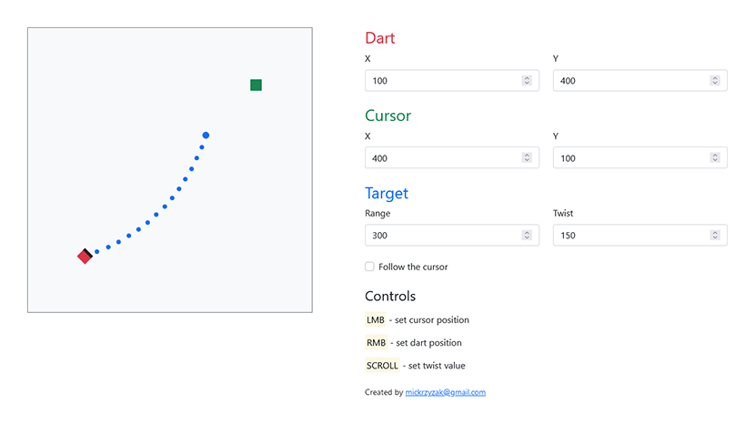

# Dart - Projectile Trajectory

Projectile trajectory mechanism for a 2D game based on throwing darts.

The script is made in **Vue.js**.

The online demo is available [here](https://mickrzyzak.github.io/dart-projectile-trajectory/).

